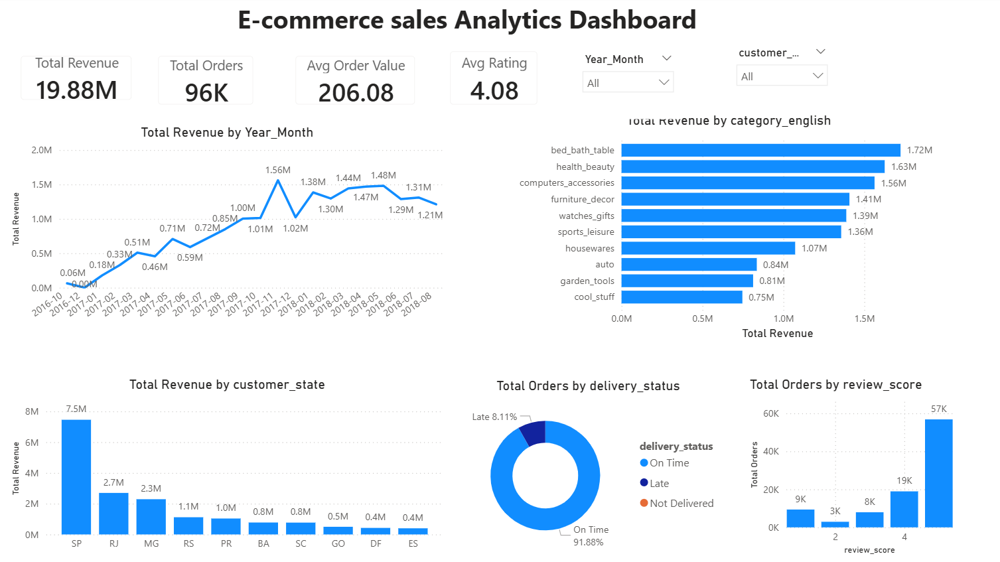

# 📊 E-commerce Sales Analytics Dashboard

An end-to-end data analysis project using PostgreSQL and Power BI to analyze 100K+ e-commerce orders and uncover actionable business insights.



---

## 📋 Table of Contents
- [Business Problem](#business-problem)
- [Objective](#objective)
- [Dataset](#dataset)
- [Tools Used](#tools-used)
- [Data Model](#data-model)
- [Key Findings](#key-findings)
- [Recommendations](#recommendations)
- [Dashboard Features](#dashboard-features)
- [SQL Queries](#sql-queries)
- [How to Use](#how-to-use)
- [Author](#author)

---

## ❓ Business Problem

An e-commerce company wants to understand:
- How is revenue trending over time?
- Which product categories perform best?
- Which regions generate the most revenue?
- How is delivery performance affecting customer satisfaction?
- What factors influence customer ratings?

---

## 🎯 Objective

Analyze e-commerce transaction data to:
- Track revenue and order trends
- Identify top-performing categories and regions
- Measure delivery performance
- Understand customer satisfaction drivers
- Provide data-driven recommendations

---

## 📁 Dataset

- **Source:** [Brazilian E-commerce Dataset (Kaggle)](https://www.kaggle.com/datasets/olistbr/brazilian-ecommerce)
- **Records:** 100,000+ orders
- **Tables:** 8 related tables
- **Time Period:** 2016 - 2018

### Database Schema:

| Table | Description | Records |
|-------|-------------|---------|
| `customers` | Customer information | 99,441 |
| `orders` | Order details and timestamps | 99,441 |
| `order_items` | Products in each order | 112,650 |
| `products` | Product information | 32,951 |
| `payments` | Payment details | 103,886 |
| `reviews` | Customer reviews and ratings | 99,224 |
| `sellers` | Seller information | 3,095 |
| `category_translation` | Portuguese to English translation | 71 |

---

## 🛠️ Tools Used

| Tool | Purpose |
|------|---------|
| **PostgreSQL** | Data storage, cleaning, and analysis |
| **Power BI** | Data visualization and dashboard creation |
| **DAX** | Calculated measures and KPIs |

---

## 🔗 Data Model

Star Schema design with:
- **Fact Table:** `sales_analysis` (combined view)
- **Dimensions:** Customer, Product, Date, Payment
```
         ┌──────────┐
         │ Products │
         └────┬─────┘
              │
┌──────────┐  │  ┌──────────────┐
│ Customers├──┼──┤ Sales_Analysis│
└──────────┘  │  │    (FACT)     │
              │  └──────┬───────┘
         ┌────┴───┐     │
         │  Date  │─────┘
         └────────┘
```

---

## 🔍 Key Findings

### Overall Metrics
| Metric | Value |
|--------|-------|
| Total Revenue | **R$ 19.88M** |
| Total Orders | **96,470** |
| Average Order Value | **R$ 206** |
| Average Rating | **4.08 / 5** |

### Revenue by State
| Rank | State | Revenue | Share |
|------|-------|---------|-------|
| 1 | SP (São Paulo) | R$ 7.5M | **~40%** |
| 2 | RJ (Rio de Janeiro) | R$ 2.7M | ~14% |
| 3 | MG (Minas Gerais) | R$ 2.3M | ~12% |

**Insight:** Top 3 states contribute **~66% of total revenue!**

### Top Product Categories
| Rank | Category | Revenue |
|------|----------|---------|
| 1 | bed_bath_table | R$ 1.72M |
| 2 | health_beauty | R$ 1.63M |
| 3 | computers_accessories | R$ 1.56M |

### Delivery Performance
| Status | Orders | Percentage |
|--------|--------|------------|
| On Time | 88,644 | **91.89%** ✅ |
| Late | 7,826 | **8.11%** ⚠️ |

### Rating Distribution
| Rating | Count | Percentage |
|--------|-------|------------|
| ⭐⭐⭐⭐⭐ 5 | 57,328 | 57.78% |
| ⭐ 1 | 11,424 | **11.51%** ⚠️ |

### Critical Insight: Delivery Affects Ratings!
| Delivery | Avg Rating |
|----------|------------|
| On Time | **4.29** ⭐ |
| Late | **2.57** ⭐ |

**Late deliveries have 40% lower ratings!**

---

## 💡 Recommendations

| # | Recommendation | Expected Impact |
|---|----------------|-----------------|
| 1 | **Focus on Top 3 States** — Increase marketing in SP, RJ, MG | Maximize ROI on marketing spend |
| 2 | **Improve Delivery** — Reduce 8% late deliveries | Improve customer ratings |
| 3 | **Investigate 1-Star Reviews** — 11.5% is higher than 2,3,4-star combined | Identify root causes |
| 4 | **Promote Top Categories** — bed_bath_table, health_beauty | Focus inventory and promotions |
| 5 | **Regional Logistics** — Optimize delivery routes for top states | Reduce delivery times |

---

## 📈 Dashboard Features

- **4 KPI Cards:** Total Revenue, Total Orders, Avg Order Value, Avg Rating
- **5 Visualizations:**
  - Monthly Revenue Trend (Line Chart)
  - Top 10 Categories by Revenue (Bar Chart)
  - Top 10 States by Revenue (Bar Chart)
  - Delivery Status (Donut Chart)
  - Rating Distribution (Column Chart)
- **2 Interactive Slicers:** Year/Month, State
- **Cross-filtering:** Click any visual to filter others

---

## 📝 SQL Queries

The analysis includes:

1. **Monthly Revenue Trend** — Track growth over time
2. **Top 10 Categories** — Best selling product categories
3. **State-wise Distribution** — Regional performance
4. **Delivery Performance** — On-time vs Late analysis
5. **Rating Distribution** — Customer satisfaction breakdown
6. **Delivery vs Rating Correlation** — Impact analysis
7. **View Creation** — Combined data for Power BI

See [ecommerce_analysis_sql.txt] for complete queries.

---

## 🚀 How to Use

### Prerequisites
- PostgreSQL (pgAdmin4)
- Power BI Desktop
- Dataset from Kaggle

### Steps
1. Clone this repository
2. Download dataset from Kaggle
3. Import CSV files into PostgreSQL
4. Run the SQL queries from `ecommerce_analysis.sql`
5. Export the view to CSV
6. Open `Ecommerce_Dashboard.pbix` in Power BI
7. Refresh data connection if needed

---

## 👤 Author

**Shubhangi Pawar**

- 📧 Email: ishubhangipawar@gmail.com
- 💼 LinkedIn: [linkedin.com/in/shubhangipawar18](https://www.linkedin.com/in/shubhangipawar18)
- 🌐 GitHub: [github.com/shubhangipawar18](https://github.com/shubhangipawar18)

### Background
Former SNOC Engineer at Vodafone with 2+ years of telecom operations experience. Now combining domain expertise with data analytics skills to drive business insights.

---

## 🙏 Acknowledgments

- Dataset: [Brazilian E-commerce by Olist (Kaggle)](https://www.kaggle.com/datasets/olistbr/brazilian-ecommerce)
- Tools: PostgreSQL, Power BI

---

⭐ **If you found this project useful, please give it a star!**


